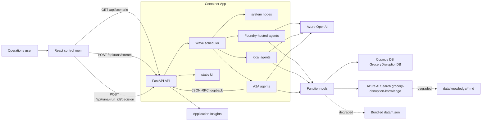
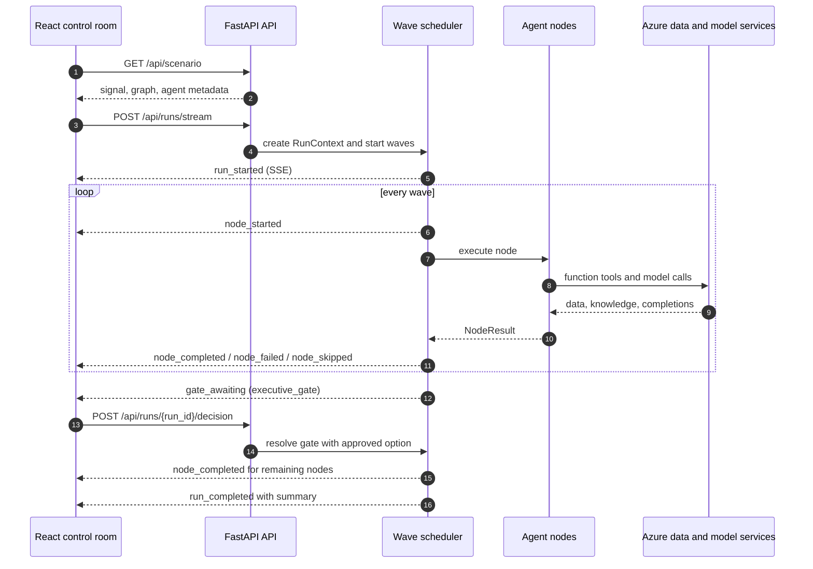
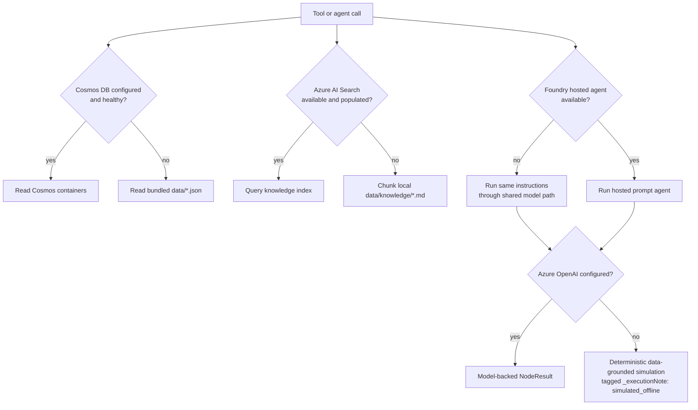

# Technical architecture

## Component view

## Request flow

1. `GET /api/health` reports model configuration, data source, knowledge source, and agent count.
2. `GET /api/scenario` returns the reference `signals.json` record, the graph, and agent metadata.
3. `POST /api/runs/stream` accepts an optional signal override or defaults to the first record in `signals.json`.
4. The API creates a run-scoped context, registers it in memory, and starts the wave scheduler.
5. The frontend receives Server-Sent Events and updates the live graph, detail panels, metrics, and gate view.
6. If `executive_gate` awaits a decision, the frontend posts `optionId`, `approver`, and `notes` to `POST /api/runs/{run_id}/decision`.
7. `GET /api/runs/{run_id}` returns the active in-memory summary while the run is registered.
8. `/a2a/{agent_name}/.well-known/agent-card.json` and `/a2a/{agent_name}` expose the A2A agent-card and JSON-RPC invocation surface.

## SSE streaming contract

Every SSE frame is emitted as `data: <json>\n\n`. The event `type` values are `run_started`, `node_started`, `node_completed`, `node_failed`, `node_skipped`, `gate_awaiting`, `run_completed`, `run_failed`, and `log`.

| Event | Required payload |
| --- | --- |
| `run_started` | `runId`, `incidentId`, `graph`, `signal` |
| `node_started` | `nodeId`, `agentName`, `hostingMode` |
| `node_completed` | `nodeId`, `result` as `NodeResult` |
| `node_failed` | `nodeId`, `error`, `result` as `NodeResult` |
| `node_skipped` | `nodeId`, `reason` |
| `gate_awaiting` | `nodeId`, `runId`, `options`, `recommendation` |
| `run_completed` | `summary` with `runId`, `incidentId`, token totals, nodes, and decision |
| `run_failed` | `error` |

`NodeResult` carries `nodeId`, `agentName`, `hostingMode`, `state`, `input`, `narrative`, `structured`, `toolCalls`, `error`, `durationMs`, `promptTokens`, `completionTokens`, and `totalTokens`.

## Azure services and why they are used

| Service | Use |
| --- | --- |
| Azure Container Apps | Hosts the single FastAPI container that serves API and built UI. |
| Container Apps manual job | Seeds data and registers agents inside the app's VNet using the same image and managed identity. |
| Virtual network, Private Link, private DNS | Connect the app and seed job to Cosmos and Blob Storage without enabling their public endpoints. |
| Azure Container Registry | Stores the `grocery-disruption` container image. |
| User-assigned managed identity | Gives the app least-privilege access without application secrets. |
| Microsoft Foundry | Stores and invokes Foundry-hosted prompt agents with the `gsdr` prefix. |
| Azure OpenAI | Provides chat completions and embeddings for model-backed nodes and knowledge seeding. |
| Azure Cosmos DB | Stores the 14 JSON datasets in `GroceryDisruptionDB`. |
| Azure AI Search | Indexes the 8-document knowledge corpus in `grocery-disruption-knowledge`. |
| Azure Storage | Holds knowledge artifacts in the private `grocery-knowledge` blob container. |
| Application Insights and Log Analytics | Capture request telemetry, traces, and operational diagnostics. |

## Degraded-mode strategy

Every Azure dependency is optional at process startup. If Cosmos DB is not configured or cannot serve a query, the repository reads bundled JSON files from `data/`. If Azure AI Search is not configured, empty, or unavailable, knowledge lookup falls back to local Markdown chunks under `data/knowledge/`. If Foundry-hosted agents are unavailable, the runner can execute the same instructions through the shared model path and annotate the result. If Azure OpenAI is absent, model-backed nodes fail gracefully while system endpoints, graph metadata, local data access, and the UI still load.

## Security model

Application code authenticates to Azure services through `DefaultAzureCredential`. In Azure, `AZURE_CLIENT_ID` selects the user-assigned managed identity. No service keys are read by the application or committed to the repository. The deployment assigns only the roles needed for ACR pull, Foundry/Azure OpenAI use, Search data and service access, Cosmos data access, Storage blob data access, and telemetry export.

The deployed app and seed job pin the credential chain to managed identity.
Cosmos and Blob public access are disabled, with no Cosmos trusted-service bypass.
Both containers use SQL and Blob private endpoints and private DNS inside a VNet-integrated
Consumption environment. GitHub starts the seed job through ARM and waits for its
specific execution; no private GitHub runner or public database allowlist is needed.
Only after the job succeeds does deployment restart the app to clear startup
fallback caches and verify that Cosmos and Azure AI Search are actually selected.

The public API should be protected before production use. Recommended hardening includes Microsoft Entra ID authentication at ingress, narrow CORS origins, role validation on `POST /api/runs/{run_id}/decision`, option membership validation, private networking where required, and content-recording controls for traces.

## Identity and RBAC design

| Principal | Scope | Purpose |
| --- | --- | --- |
| Container App user-assigned identity | ACR | Pull the `grocery-disruption` image. |
| Container App user-assigned identity | Foundry and Azure OpenAI | Invoke model deployments and hosted agents. |
| App and seed-job user-assigned identity | Cosmos DB | Seed and read domain datasets through the private endpoint. |
| Container App user-assigned identity | Azure AI Search | Query and update the knowledge index where seeding uses the app identity. |
| Container App user-assigned identity | Storage | Read or write knowledge blobs when the storage-backed path is used. |
| Foundry project identity | Azure AI Search | Read the knowledge index for native hosted-agent grounding. |
| GitHub workflow identity or service principal | Resource group | Build images and deploy Bicep from workflows. |
