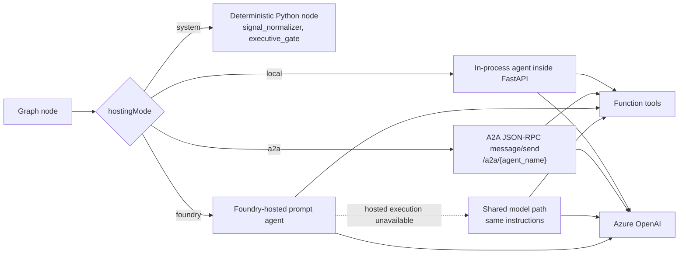
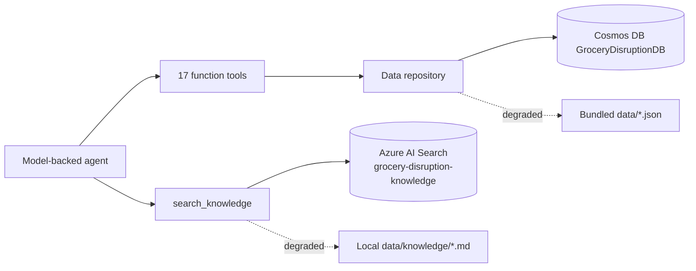

# Agents

This catalogue documents the canonical twenty-node roster. Node ids, agent names, labels, groups, and hosting modes are fixed by the design specification.

## Hosting modes

## Hosting summary

| node_id | Agent | Purpose | Hosting |
| --- | --- | --- | --- |
| `signal_normalizer` | `ShortageSignalNormalizer` | Normalize signal and severity. | `system` |
| `situation_assessment` | `SituationAssessmentAgent` | Scope the incident and current constraints. | `foundry` |
| `historical_knowledge` | `HistoricalKnowledgeAgent` | Retrieve precedent and playbooks. | `foundry` |
| `demand_forecast` | `DemandForecastAgent` | Quantify surge demand by SKU and region. | `local` |
| `network_inventory` | `NetworkInventoryAgent` | Quantify DC and store inventory cover. | `local` |
| `financial_impact` | `FinancialImpactAgent` | Quantify revenue, margin, promotion, and penalty exposure. | `a2a` |
| `store_impact` | `StoreImpactAgent` | Quantify store and customer impact. | `a2a` |
| `impact_synthesis` | `ImpactSynthesisAgent` | Consolidate impact evidence. | `foundry` |
| `response_planner` | `ResponsePlannerAgent` | Generate four response options. | `foundry` |
| `sourcing_procurement` | `SourcingProcurementAgent` | Validate sourcing feasibility. | `a2a` |
| `allocation_fairness` | `AllocationFairnessAgent` | Validate fair-share allocation. | `local` |
| `substitution_assortment` | `SubstitutionAssortmentAgent` | Validate substitutes and assortment changes. | `local` |
| `pricing_compliance` | `PricingComplianceAgent` | Validate pricing and consumer-protection constraints. | `a2a` |
| `logistics_cold_chain` | `LogisticsColdChainAgent` | Validate chilled logistics and transfer feasibility. | `a2a` |
| `scenario_evaluation` | `ScenarioEvaluationAgent` | Score and rank all options. | `foundry` |
| `deliberation` | `DeliberationAgent` | Debate close-call recommendations. | `foundry` |
| `executive_gate` | `ExecutiveApprovalGate` | Capture approval or timeout decision. | `system` |
| `store_operations` | `StoreOperationsAgent` | Produce store execution plan. | `foundry` |
| `customer_communication` | `CustomerCommunicationAgent` | Produce customer and colleague communications. | `foundry` |
| `executive_briefing` | `ExecutiveBriefingAgent` | Produce final executive decision record. | `foundry` |

## Tool catalogue

| Tool | Parameters | Returns |
| --- | --- | --- |
| `get_product` | `product_id: str` | one product/SKU record |
| `get_supplier` | `supplier_id: str` | one supplier record |
| `find_alternative_suppliers` | `product_id: str` | supplier records from the product's `alternateSupplierIds` |
| `get_warehouse_inventory` | `product_id: str` | inventory rows where `locationType == "warehouse"` |
| `get_store_inventory` | `product_id: str`, `region: str \| None` | inventory rows where `locationType == "store"`, optionally filtered by region |
| `get_dependent_products` | `product_id: str` | products whose `inputProductIds` contains the id |
| `get_warehouses` | `warehouse_ids: list[str] \| None` | warehouse records |
| `get_replenishment_schedule` | `warehouse_id: str \| None` | scheduled inbound deliveries, capped at 40 rows |
| `get_stores_for_skus` | `sku_ids: list[str]` | store-cluster records selling any of those SKUs |
| `get_demand_forecast` | `sku_ids: list[str]` | baseline versus surge demand rows |
| `get_commitments_for_skus` | `sku_ids: list[str]` | supply/private-label contracts for those SKUs |
| `get_promotions_for_skus` | `sku_ids: list[str]` | live/planned promotions covering those SKUs |
| `get_substitutes` | `product_id: str` | substitute products with conversion ratio and constraints |
| `get_past_disruptions` | `product_id: str \| None` | prior disruption records |
| `get_playbooks` | `category: str \| None` | response playbooks |
| `get_stakeholders` | `function: str \| None` | stakeholder directory |
| `search_knowledge` | `query: str` | knowledge-corpus passages, top 4 |

Tools and retrieval ground every model-backed node in the same domain data:

## Detailed catalogue

| node_id | Tools used | JSON output contract | Upstream | Downstream |
| --- | --- | --- | --- | --- |
| `signal_normalizer` | none | A `NodeResult` whose `structured` value is the normalized signal assessment and initial severity. | none | situation_assessment |
| `situation_assessment` | get_product, get_supplier, get_warehouse_inventory, get_store_inventory, get_dependent_products, get_replenishment_schedule | A `NodeResult` whose `structured` value is the situational assessment for the product, supplier, SKUs, regions, warehouses, cover, and root cause. | signal_normalizer | historical_knowledge |
| `historical_knowledge` | get_past_disruptions, get_playbooks, search_knowledge | A `NodeResult` whose `structured` value is precedent, playbook, lesson, source, and policy evidence. | situation_assessment | demand_forecast, network_inventory, financial_impact, store_impact |
| `demand_forecast` | get_demand_forecast, get_promotions_for_skus, get_stores_for_skus | A `NodeResult` whose `structured` value is baseline, current, and four-week surge demand by SKU and region. | historical_knowledge | impact_synthesis |
| `network_inventory` | get_warehouse_inventory, get_store_inventory, get_warehouses, get_replenishment_schedule | A `NodeResult` whose `structured` value is DC, store-cluster, inbound, cover, transfer, and expiry-risk evidence. | historical_knowledge | impact_synthesis |
| `financial_impact` | get_product, get_commitments_for_skus, get_promotions_for_skus, get_dependent_products | A `NodeResult` whose `structured` value is quantified EUR exposure, assumptions, and SKU/region breakdowns. | historical_knowledge | impact_synthesis |
| `store_impact` | get_stores_for_skus, get_store_inventory, get_promotions_for_skus, get_stakeholders | A `NodeResult` whose `structured` value is store-cluster, shelf, customer, purchase-limit, and service-risk evidence. | historical_knowledge | impact_synthesis |
| `impact_synthesis` | search_knowledge | A `NodeResult` whose `structured` value consolidates the four impact branches and records missing evidence. | demand_forecast, network_inventory, financial_impact, store_impact | response_planner |
| `response_planner` | find_alternative_suppliers, get_substitutes, get_playbooks, get_replenishment_schedule, get_dependent_products | A `NodeResult` whose `structured` value contains exactly four options. Each option uses the canonical option contract below. | impact_synthesis | sourcing_procurement, allocation_fairness, substitution_assortment, pricing_compliance, logistics_cold_chain |
| `sourcing_procurement` | find_alternative_suppliers, get_supplier, get_commitments_for_skus | A `NodeResult` whose `structured` value validates supplier capacity, qualification, cost, and lead-time feasibility for each option. | response_planner | scenario_evaluation |
| `allocation_fairness` | get_warehouse_inventory, get_store_inventory, get_stores_for_skus, get_commitments_for_skus, get_playbooks | A `NodeResult` whose `structured` value validates fair-share allocation for each option. | response_planner | scenario_evaluation |
| `substitution_assortment` | get_substitutes, get_dependent_products, get_product, search_knowledge | A `NodeResult` whose `structured` value validates substitutes, reformulation, assortment, acceptance, and labelling impact for each option. | response_planner | scenario_evaluation |
| `pricing_compliance` | get_promotions_for_skus, get_playbooks, search_knowledge, get_stakeholders | A `NodeResult` whose `structured` value validates pricing, promotion, approval, and communication compliance for each option. | response_planner | scenario_evaluation |
| `logistics_cold_chain` | get_warehouses, get_replenishment_schedule, get_warehouse_inventory, get_store_inventory | A `NodeResult` whose `structured` value validates chilled capacity, transfers, inbound doors, and transport feasibility for each option. | response_planner | scenario_evaluation |
| `scenario_evaluation` | search_knowledge | A `NodeResult` whose `structured` value uses the canonical scoring contract below. | sourcing_procurement, allocation_fairness, substitution_assortment, pricing_compliance, logistics_cold_chain | deliberation |
| `deliberation` | search_knowledge | A `NodeResult` whose `structured` value records close-call reasoning and the converged recommendation. | scenario_evaluation | executive_gate |
| `executive_gate` | none | A `NodeResult` whose `structured` value records the approved option, approver, notes, auto-approval status, and recommendation alignment. | deliberation | store_operations, customer_communication |
| `store_operations` | get_stakeholders, get_playbooks, get_stores_for_skus, get_warehouses | A `NodeResult` whose `structured` value is the approved store operations execution plan. | executive_gate | executive_briefing |
| `customer_communication` | get_stakeholders, get_playbooks, search_knowledge | A `NodeResult` whose `structured` value is the approved colleague, customer, signage, and digital-channel communication plan. | executive_gate | executive_briefing |
| `executive_briefing` | search_knowledge | A `NodeResult` whose `structured` value is the final executive briefing and decision record. | store_operations, customer_communication | none |

## Common result envelope

Every node returns a `NodeResult` over the wire: `nodeId`, `agentName`, `hostingMode`, `state`, `input`, `narrative`, `structured`, `toolCalls`, `error`, `durationMs`, `promptTokens`, `completionTokens`, and `totalTokens`. The `structured` object contains the node-specific contract shown above.

## Option and scoring contracts

`response_planner` always emits exactly four options with `optionId` values `A`, `B`, `C`, and `D`. Each option contains `title`, `description`, `leverPrimary`, `costEur`, `timeToImplementDays`, `riskLevel`, `customerImpact`, `shelfAvailabilityRecoveryPct`, `expectedOutcome`, `keyActions`, and `dependencies`.

`scenario_evaluation` scores every option from 0 to 100 on `financial`, `operational`, `customer`, `compliance`, and `sustainability`, then returns `totalScore`, `recommendedOptionId`, `closeCall`, and `rationale`.

