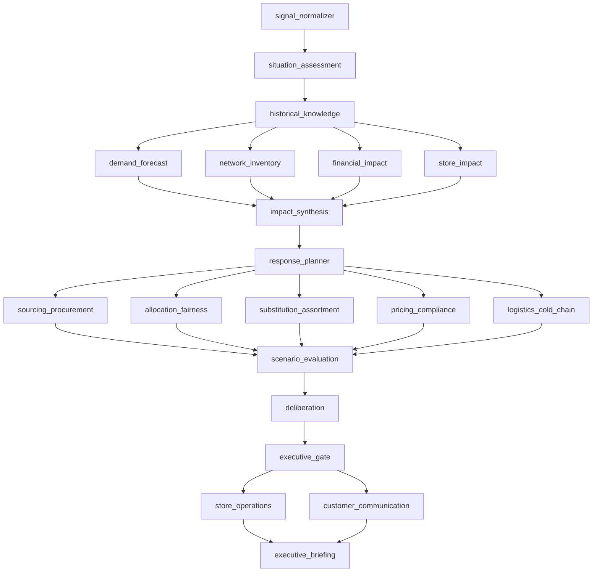
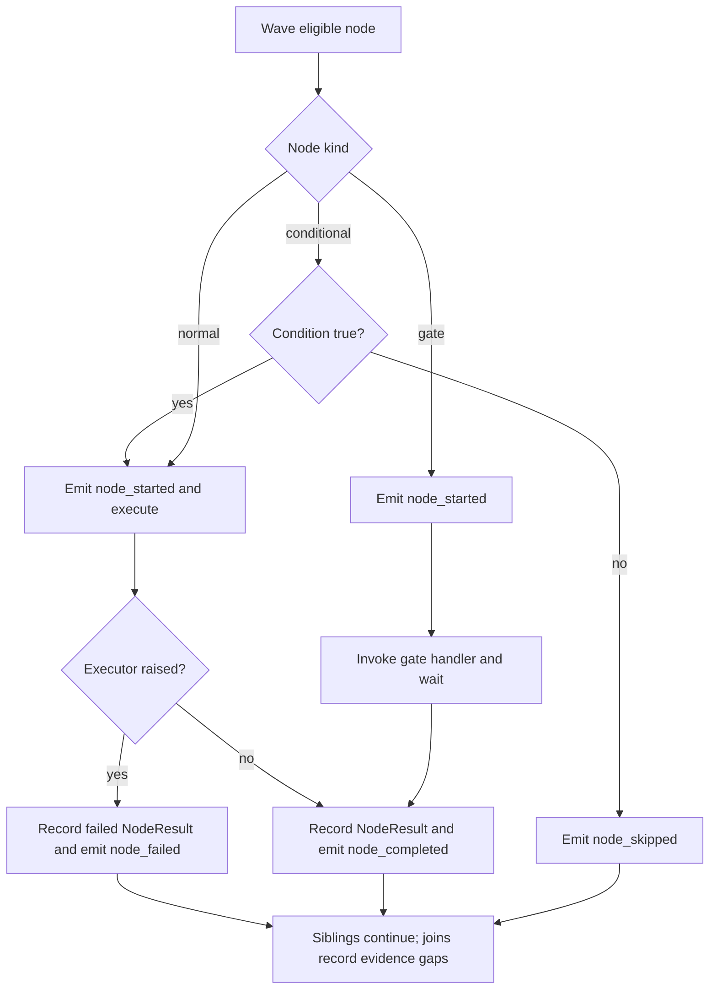
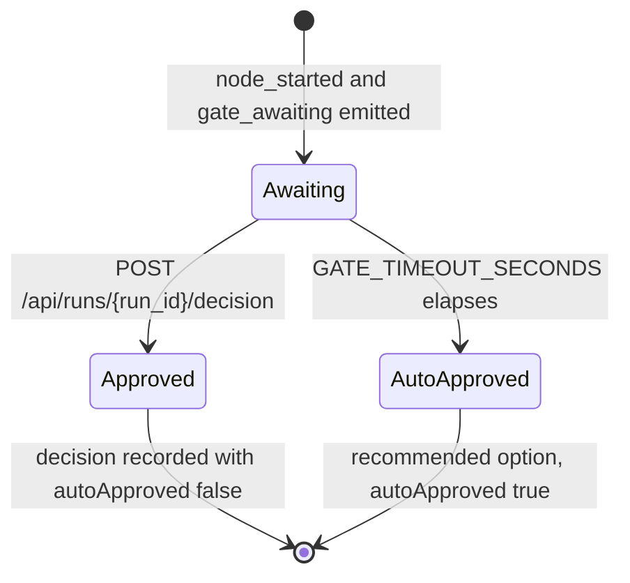

# Orchestration

## Canonical DAG



## Exact dependencies

```text
situation_assessment      <- [signal_normalizer]
historical_knowledge      <- [situation_assessment]
demand_forecast           <- [historical_knowledge]
network_inventory         <- [historical_knowledge]
financial_impact          <- [historical_knowledge]
store_impact              <- [historical_knowledge]
impact_synthesis          <- [demand_forecast, network_inventory, financial_impact, store_impact]
response_planner          <- [impact_synthesis]
sourcing_procurement      <- [response_planner]
allocation_fairness       <- [response_planner]
substitution_assortment   <- [response_planner]
pricing_compliance        <- [response_planner]
logistics_cold_chain      <- [response_planner]
scenario_evaluation       <- [sourcing_procurement, allocation_fairness, substitution_assortment, pricing_compliance, logistics_cold_chain]
deliberation              <- [scenario_evaluation]
executive_gate            <- [deliberation]
store_operations          <- [executive_gate]
customer_communication    <- [executive_gate]
executive_briefing        <- [store_operations, customer_communication]
```

## Execution waves

| Wave | Nodes | Pattern |
| --- | --- | --- |
| 0 | `signal_normalizer` | Deterministic entry point |
| 1 | `situation_assessment` | Sequential situational analysis |
| 2 | `historical_knowledge` | Sequential retrieval |
| 3 | `demand_forecast`, `network_inventory`, `financial_impact`, `store_impact` | Four-wide concurrent impact fan-out |
| 4 | `impact_synthesis` | Fan-in |
| 5 | `response_planner` | Option generation |
| 6 | `sourcing_procurement`, `allocation_fairness`, `substitution_assortment`, `pricing_compliance`, `logistics_cold_chain` | Five-wide concurrent validation fan-out |
| 7 | `scenario_evaluation` | Fan-in and ranking |
| 8 | `deliberation` | Conditional route |
| 9 | `executive_gate` | Human-in-the-loop suspension |
| 10 | `store_operations`, `customer_communication` | Two-wide execution fan-out |
| 11 | `executive_briefing` | Final fan-in |

```mermaid
flowchart LR
    w0["Wave 0<br/>signal_normalizer"] --> w1["Wave 1<br/>situation_assessment"] --> w2["Wave 2<br/>historical_knowledge"]
    w2 --> w3["Wave 3<br/>4 concurrent impact nodes"] --> w4["Wave 4<br/>impact_synthesis"] --> w5["Wave 5<br/>response_planner"]
    w5 --> w6["Wave 6<br/>5 concurrent validation nodes"] --> w7["Wave 7<br/>scenario_evaluation"] --> w8["Wave 8<br/>deliberation (conditional)"]
    w8 --> w9["Wave 9<br/>executive_gate (human)"] --> w10["Wave 10<br/>store_operations + customer_communication"] --> w11["Wave 11<br/>executive_briefing"]
```



## Five patterns

| Pattern | Implementation detail |
| --- | --- |
| Sequential spine | The main decision path advances through the graph in dependency order. |
| Concurrent fan-out/fan-in | Four impact nodes and five validation nodes run as independent waves, then join. |
| Conditional routing | `deliberation` runs only when the evaluator marks a close call or top scores are within threshold. |
| Human-in-the-loop | `executive_gate` waits for an external decision and resumes the same run. |
| Graceful degradation | Failed nodes are recorded and downstream joins continue with explicit evidence gaps. |

## Wave scheduler



The scheduler computes a depth for every node from the dependency list. Nodes with the same depth are eligible to run concurrently after all declared dependencies have produced a terminal result. Terminal means completed, failed, or skipped. The design deliberately keeps run state in a `RunContext` so two incidents can run without shared mutable state.

For normal nodes the scheduler emits `node_started`, calls the node executor, records the `NodeResult`, then emits `node_completed` or `node_failed`. For conditional nodes it evaluates the node condition before execution and emits `node_skipped` if the condition is false. For gate nodes it emits `node_started`, invokes the configured gate handler, and waits for external resolution.

## Conditional deliberation rule

`deliberation` depends on `scenario_evaluation`. It runs only when deliberation is enabled and one of these conditions is true:

* `scenario_evaluation.structured.closeCall` is `true`.
* The difference between the highest two `totalScore` values is less than or equal to `8.0` points.

If neither condition is met, `deliberation` is skipped and the gate uses the scenario evaluator's recommendation.

## Human-in-the-loop gate protocol



When `executive_gate` starts, it emits `gate_awaiting` with the available options and the recommendation:

```json
{
  "type": "gate_awaiting",
  "nodeId": "executive_gate",
  "runId": "run-000000000000",
  "options": [],
  "recommendation": { "optionId": "A", "rationale": "Highest weighted score." }
}
```

The decision REST call is:

```http
POST /api/runs/{run_id}/decision
Content-Type: application/json

{
  "optionId": "B",
  "approver": "Executive Committee",
  "notes": "Proceed with reviewed constraints."
}
```

`optionId` is required. The accepted decision is recorded with `autoApproved: false`. If no decision arrives before `GATE_TIMEOUT_SECONDS` (default `900` seconds), the gate selects the recommended option, sets `approver` to `Auto-approved (gate timeout)`, writes the timeout note, and records `autoApproved: true`.

## Failure and degradation semantics

A node exception becomes a failed `NodeResult` and a `node_failed` SSE event. Sibling nodes in the same wave continue. Join nodes must record missing inputs in their structured output, usually under `gapsInAnalysis` or a node-specific equivalent. Azure dependency failures fall back to bundled JSON and local Markdown where possible. Browser disconnect cancels the active stream and releases the in-memory run registry entry.

