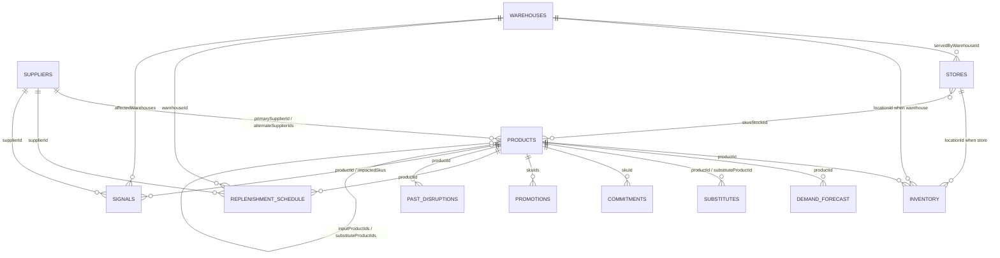

# Data model

Every dataset is a JSON array of objects. Every object has a unique `id` and a `partitionKey` equal to the stable grouping value required for Cosmos DB seeding.

## Dataset relationships

`playbooks.json` and `stakeholders.json` are reference datasets used by retrieval
and execution nodes rather than keyed foreign tables; the remaining twelve
datasets are linked by the identifiers shown above and enforced by the
[referential-integrity rules](#referential-integrity-rules).

## Container mapping

| Cosmos container | Repository file |
| --- | --- |
| products | products.json |
| suppliers | suppliers.json |
| warehouses | warehouses.json |
| stores | stores.json |
| inventory | inventory.json |
| demandForecast | demand-forecast.json |
| substitutes | substitutes.json |
| commitments | commitments.json |
| promotions | promotions.json |
| replenishmentSchedule | replenishment-schedule.json |
| pastDisruptions | past-disruptions.json |
| playbooks | playbooks.json |
| stakeholders | stakeholders.json |
| signals | signals.json |

## 1. `products.json`

Purpose: Shell-egg SKUs and egg-dependent private-label bakery, ready-meal, chilled, and ambient SKUs.

| Field | Type |
| --- | --- |
| `id` | string |
| `partitionKey` | string |
| `name` | string |
| `category` | eggs | bakery | ready-meals | chilled | ambient |
| `subCategory` | shell-eggs | liquid-egg | bakery | pasta | dessert |
| `brandType` | private-label | national-brand |
| `eanCode` | string |
| `unitOfMeasure` | string |
| `unitsPerCase` | number |
| `shelfLifeDays` | number |
| `retailPriceEur` | number |
| `unitCostEur` | number |
| `marginPct` | number |
| `weeklyUnitsSold` | number |
| `strategicTier` | traffic-driver | core | long-tail |
| `primarySupplierId` | string |
| `alternateSupplierIds` | string[] |
| `inputProductIds` | string[] |
| `eggContentUnitsPerCase` | number |
| `substituteProductIds` | string[] |
| `regionsSold` | string[] |
| `notes` | string |

## 2. `suppliers.json`

Purpose: Domestic producers, packing centres, importers, and processors with capacity and avian-influenza status.

| Field | Type |
| --- | --- |
| `id` | string |
| `partitionKey` | string |
| `name` | string |
| `type` | producer-cooperative | packing-centre | importer | processor |
| `country` | string |
| `region` | string |
| `qualificationStatus` | qualified | provisional | unqualified |
| `qualificationLeadTimeDays` | number |
| `leadTimeDays` | number |
| `capacityCasesPerWeek` | number |
| `availableCapacityCasesPerWeek` | number |
| `unitPriceEurPerCase` | number |
| `priceChangePct` | number |
| `reliabilityScore` | number |
| `sustainabilityScore` | number |
| `co2KgPerCase` | number |
| `farmingMethods` | string[] |
| `certifications` | string[] |
| `avianInfluenzaStatus` | unaffected | restricted-zone | culled | quarantine |
| `riskFlags` | string[] |
| `notes` | string |

## 3. `warehouses.json`

Purpose: The 8 regional distribution centres serving stores and carrying chilled capacity.

| Field | Type |
| --- | --- |
| `id` | string |
| `partitionKey` | string |
| `name` | string |
| `region` | NORTH | SOUTH | EAST | WEST | CENTRE |
| `city` | string |
| `storesServed` | number |
| `chilledCapacityPallets` | number |
| `chilledUtilizationPct` | number |
| `ambientCapacityPallets` | number |
| `inboundDoorsPerDay` | number |
| `crossDockCapable` | boolean |
| `transferLeadTimeHours` | object |
| `notes` | string |

## 4. `stores.json`

Purpose: Store-cluster records representing formats and regions rather than individual stores.

| Field | Type |
| --- | --- |
| `id` | string |
| `partitionKey` | string |
| `name` | string |
| `region` | string |
| `format` | hypermarket | supermarket | convenience | drive |
| `storeCount` | number |
| `servedByWarehouseId` | string |
| `weeklyFootfall` | number |
| `loyaltyMembers` | number |
| `skusStocked` | string[] |
| `avgWeeklyEggCases` | number |
| `currentDaysOfCover` | number |
| `shelfAvailabilityPct` | number |
| `priceSensitivityIndex` | number |
| `notes` | string |

## 5. `inventory.json`

Purpose: Warehouse and store inventory positions for eggs and dependent products.

| Field | Type |
| --- | --- |
| `id` | string |
| `partitionKey` | string |
| `locationType` | warehouse | store |
| `locationId` | string |
| `region` | string |
| `productId` | string |
| `onHandCases` | number |
| `committedCases` | number |
| `availableCases` | number |
| `inTransitCases` | number |
| `weeklyConsumptionCases` | number |
| `daysOfCover` | number |
| `safetyStockCases` | number |
| `expiryRiskCases` | number |
| `lastCountedAt` | ISO 8601 string |

## 6. `demand-forecast.json`

Purpose: Baseline and surge demand by SKU and region across the next four weeks.

| Field | Type |
| --- | --- |
| `id` | string |
| `partitionKey` | string |
| `productId` | string |
| `region` | string |
| `baselineWeeklyCases` | number |
| `currentWeeklyCases` | number |
| `surgePct` | number |
| `forecastWeek1Cases` | number |
| `forecastWeek2Cases` | number |
| `forecastWeek3Cases` | number |
| `forecastWeek4Cases` | number |
| `confidence` | number |
| `drivers` | string[] |
| `priceElasticity` | number |

## 7. `substitutes.json`

Purpose: Like-for-like, format, plant-based, liquid-egg, and reformulation substitutes.

| Field | Type |
| --- | --- |
| `id` | string |
| `partitionKey` | string |
| `productId` | string |
| `substituteProductId` | string |
| `substituteName` | string |
| `substitutionType` | like-for-like | format-change | plant-based | liquid-egg | recipe-reformulation |
| `conversionRatio` | number |
| `availabilityCasesPerWeek` | number |
| `priceDeltaPct` | number |
| `customerAcceptanceScore` | number |
| `labellingChangeRequired` | boolean |
| `allergenImpact` | string |
| `leadTimeDays` | number |
| `constraints` | string[] |
| `notes` | string |

## 8. `commitments.json`

Purpose: Private-label, franchise, wholesale, and promotional commitments with service levels and penalties.

| Field | Type |
| --- | --- |
| `id` | string |
| `partitionKey` | string |
| `skuId` | string |
| `counterparty` | string |
| `commitmentType` | private-label-supply | franchise-allocation | b2b-wholesale | promotional |
| `weeklyCases` | number |
| `contractEndDate` | date string |
| `penaltyEurPerMissedCase` | number |
| `serviceLevelTargetPct` | number |
| `currentServiceLevelPct` | number |
| `priority` | string |
| `notes` | string |

## 9. `promotions.json`

Purpose: Live, planned, and paused promotional campaigns involving constrained SKUs.

| Field | Type |
| --- | --- |
| `id` | string |
| `partitionKey` | string |
| `name` | string |
| `skuIds` | string[] |
| `status` | live | planned | paused |
| `startDate` | date string |
| `endDate` | date string |
| `mechanic` | string |
| `expectedUpliftPct` | number |
| `forecastIncrementalCases` | number |
| `printedLeafletCommitted` | boolean |
| `cancellationCostEur` | number |
| `regions` | string[] |
| `notes` | string |

## 10. `replenishment-schedule.json`

Purpose: Inbound supplier deliveries, confirmations, shortfalls, transport mode, and status.

| Field | Type |
| --- | --- |
| `id` | string |
| `partitionKey` | string |
| `warehouseId` | string |
| `supplierId` | string |
| `productId` | string |
| `scheduledDate` | date string |
| `orderedCases` | number |
| `confirmedCases` | number |
| `shortfallCases` | number |
| `status` | confirmed | short-confirmed | cancelled | at-risk |
| `transportMode` | string |
| `notes` | string |

## 11. `past-disruptions.json`

Purpose: Prior disruptions, mitigations, costs, effectiveness, and lessons learned.

| Field | Type |
| --- | --- |
| `id` | string |
| `partitionKey` | string |
| `title` | string |
| `productId` | string |
| `category` | string |
| `date` | date string |
| `durationDays` | number |
| `rootCause` | string |
| `peakShortfallPct` | number |
| `revenueLostEur` | number |
| `mitigationsApplied` | object[] with action, outcome, effectivenessScore, costEur |
| `lessonsLearned` | string[] |
| `notes` | string |

## 12. `playbooks.json`

Purpose: Response playbooks by category with steps, costs, lead times, approvals, and regulatory notes.

| Field | Type |
| --- | --- |
| `id` | string |
| `partitionKey` | string |
| `name` | string |
| `category` | allocation | sourcing | substitution | pricing | communication | logistics | promotion |
| `trigger` | string |
| `steps` | string[] |
| `typicalCostEur` | number |
| `leadTimeDays` | number |
| `requiredApprovals` | string[] |
| `expectedEffectivenessScore` | number |
| `regulatoryNotes` | string |
| `notes` | string |

## 13. `stakeholders.json`

Purpose: Decision owners and escalation contacts by business function and region.

| Field | Type |
| --- | --- |
| `id` | string |
| `partitionKey` | string |
| `name` | string |
| `role` | string |
| `function` | supply-chain | merchandising | store-operations | finance | quality | communications | legal | executive |
| `decisionAuthority` | string |
| `escalationLevel` | number |
| `email` | string |
| `regionsCovered` | string[] |
| `notes` | string |

## 14. `signals.json`

Purpose: The primary incident and alternate scenarios matching DisruptionSignal camelCase keys.

| Field | Type |
| --- | --- |
| `id` | string |
| `partitionKey` | string |
| `productId` | string |
| `productName` | string |
| `category` | string |
| `supplierId` | string |
| `confidence` | number |
| `depletionDaysMin` | number |
| `depletionDaysMax` | number |
| `supplyShortfallPct` | number |
| `demandSurgePct` | number |
| `impactedSkus` | string[] |
| `affectedRegions` | string[] |
| `affectedWarehouses` | string[] |
| `rootCause` | string |
| `source` | string |
| `detectedAt` | ISO 8601 string |

## Knowledge corpus

The retrieval corpus under `data/knowledge/` contains exactly these 8 documents:

* `2022-avian-influenza-postmortem.md`
* `fair-share-allocation-policy.md`
* `warehouse-allocation-playbook.md`
* `egg-substitution-and-reformulation-guide.md`
* `pricing-and-consumer-protection-rules.md`
* `food-safety-and-avian-influenza-regulation.md`
* `store-communication-and-signage-standards.md`
* `responsible-sourcing-and-animal-welfare-standards.md`

Each document is written as long-form corporate knowledge with headings, concrete numbers, thresholds, and procedures that agents can cite.

## Referential-integrity rules

* `products.primarySupplierId` and each value in `products.alternateSupplierIds` must reference `suppliers.id`.
* `products.inputProductIds` and `products.substituteProductIds` must reference `products.id`.
* `stores.servedByWarehouseId` must reference `warehouses.id`; `stores.skusStocked` values must reference `products.id`.
* `inventory.locationId` references `warehouses.id` when `locationType` is `warehouse` and `stores.id` when `locationType` is `store`.
* `inventory.productId`, `demand-forecast.productId`, `substitutes.productId`, `substitutes.substituteProductId`, `replenishment-schedule.productId`, and `signals.productId` must reference `products.id`.
* `commitments.skuId` and every value in `promotions.skuIds` must reference `products.id`.
* `replenishment-schedule.warehouseId` references `warehouses.id`; `replenishment-schedule.supplierId` references `suppliers.id`.
* `past-disruptions.productId` references `products.id` when product-specific.
* `signals.supplierId` references `suppliers.id`; `signals.impactedSkus` references `products.id`; `signals.affectedWarehouses` references `warehouses.id`.
* Region values must use `NORTH`, `SOUTH`, `EAST`, `WEST`, and `CENTRE` where regional scope is represented.

