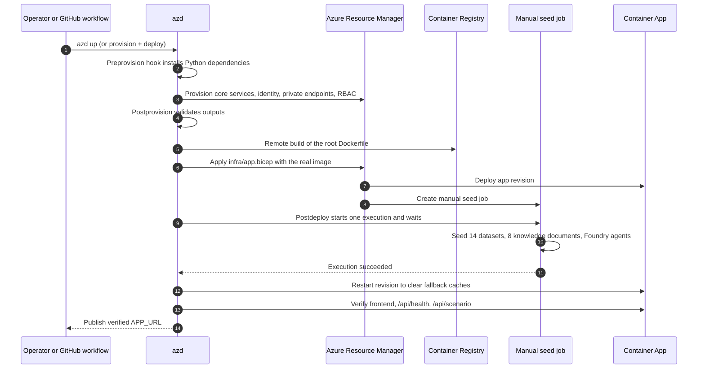
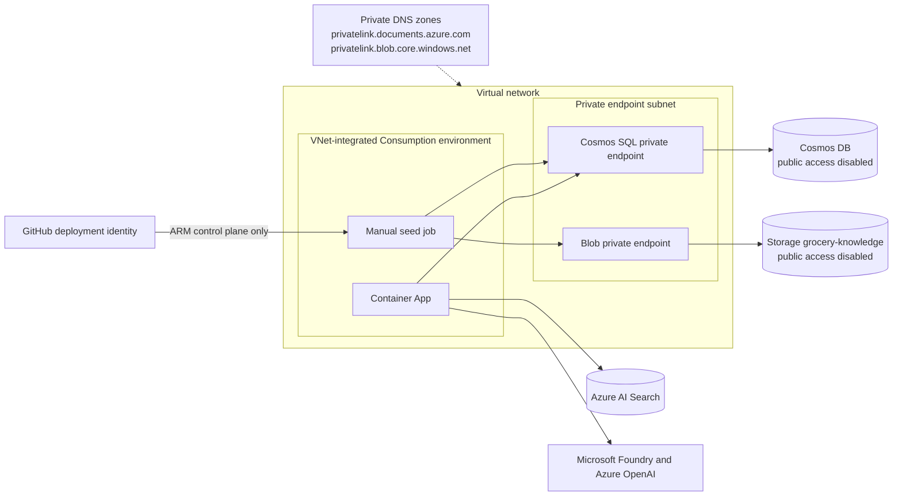
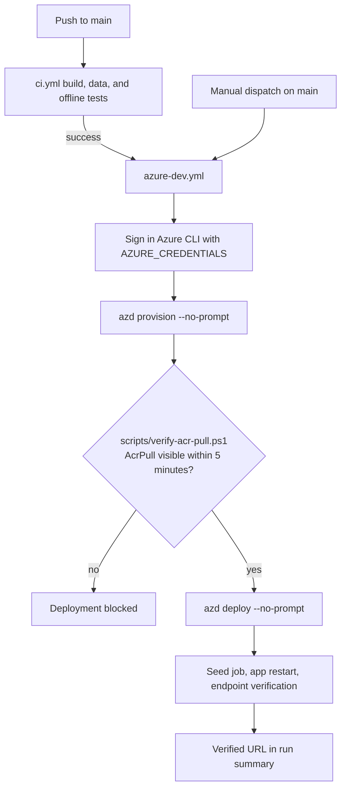

# Deploy with Azure Developer CLI

The local command and GitHub Actions both use `azure.yaml`, the same Bicep
templates, and the same provisioning and verification hooks. Local deployment uses
interactive azd authentication; GitHub uses the `AZURE_CREDENTIALS` repository secret.

## Prerequisites and cost

- Azure Developer CLI (`azd`) 1.25.0 or newer, PowerShell 7, and Python 3.11+.
- Azure CLI for the GitHub pre-deploy RBAC gate and Bicep validation; GitHub CLI for pipeline setup.
- An authenticated identity in the target tenant with subscription resource
  deployment rights and `Microsoft.Authorization/roleAssignments/write`.
  Contributor alone cannot create the required role assignments.
- Available Foundry chat and embedding models and sufficient quota in the selected
  region. Defaults are configurable; a successful template build does not prove quota.
- Access to the organization-protected package feeds. The Docker build and CI use
  `https://packagefeedproxy.microsoft.io/npm/` and
  `https://packagefeedproxy.microsoft.io/pypi/simple`.

Provisioning creates billable Container Apps, a manual seed job, ACR, Cosmos DB
shared throughput, private endpoints/DNS zones, AI Search, Foundry model deployments,
Blob Storage, and observability resources. Cosmos DB and Blob are private; the frontend,
Search and model endpoints remain publicly reachable with their configured
authentication. This is a **demonstration**, not a production security baseline.
Only fictional data should be uploaded. The UI/API has no application-level user
authentication; restrict ingress or add authentication before exposing sensitive data.
Azure resource access uses managed identity and resource-scoped RBAC.

## Local deployment

From the repository root:

```powershell
azd auth login --tenant-id 6d84d14b-2ff0-4d99-9ab1-fae089687459
pwsh .\scripts\setup-azd.ps1
azd provision --preview
azd up
```

`setup-azd.ps1` only creates/selects local azd configuration; it does not provision
resources or change the Azure CLI account. Its defaults are:

| Setting | Value |
| --- | --- |
| Environment | `grocery-disruption` |
| Subscription | `bb766161-890c-4a8e-9c63-981b510e4e38` |
| Tenant | `6d84d14b-2ff0-4d99-9ab1-fae089687459` |
| Region | `swedencentral` |
| Default resource group | `rg-grocery-disruption` |

Use a different isolated environment or region with:

```powershell
pwsh .\scripts\setup-azd.ps1 -EnvironmentName grocery-test -Location swedencentral
azd up --environment grocery-test
```

Pass `-SubscriptionId` and `-TenantId` to change the Azure target; sign in to the
corresponding tenant first. `.azure/` environment state remains git-ignored.
The original `pwsh .\scripts\deploy.ps1` command is a compatibility wrapper around
setup followed by `azd up`, not a second independent deployment implementation.

## What azd does



| Phase | Behavior |
| --- | --- |
| Preprovision | Checks/sets up Python dependencies needed for deployment hooks. |
| Provision | Creates the resource group, core services, private Cosmos connectivity, identities, and resource-scoped data roles. |
| Postprovision | Validates outputs. Data-plane operations are deferred to the in-network job, not run on GitHub. |
| Build and deploy | Builds the root Dockerfile using ACR remote build, then applies `infra/app.bicep` with the real image for both the app and manual seed job. |
| Postdeploy | Starts the seed job, waits for that exact execution to succeed, restarts the app revision to clear startup fallback caches, then checks the frontend, health, and scenario before publishing a verified URL. |

The runtime/seed-job identity and deployment identity are separate. The job uses
the app's user-assigned managed identity and existing resource-scoped data roles
to seed Cosmos/Search/Storage and register Foundry definitions. GitHub's deployment
identity starts and monitors it through ARM; it never needs public access to Cosmos.
The retained deployer data roles do not bypass the database firewall. The deployment
principal is resolved by azd as `AZURE_PRINCIPAL_ID`; do not set it to a
client/application ID or copy a developer's object ID into CI.

### Private data connectivity



The app and seed job share a VNet-integrated Consumption environment. A separate
subnet hosts Cosmos SQL and Blob private endpoints, with
`privatelink.documents.azure.com` and `privatelink.blob.core.windows.net`
zones linked to the VNet. Both services disable public access and key authentication. Cosmos has
`publicNetworkAccess: Disabled`, `networkAclBypass: None`, and key authentication
disabled. No runner-IP allowlist or Azure-wide firewall bypass is needed.

The environment name includes `env-private`. Azure cannot retrofit VNet integration
onto the original non-VNet environment, so the template creates a new environment
without deleting the old one. During the initial repair no Container App had yet
been deployed. An app already deployed in an old environment requires an explicit
migration; the template cannot change its environment in place. Review unused
resources separately rather than deleting them automatically.

The manual job uses the same image as the app, including `scripts/` and the bundled
data. It upserts 14 datasets, indexes eight knowledge documents, and registers the
Foundry agents. It has no ingress and is not scheduled; each deployment starts one
execution, with no automatic replica retries. A failed or timed-out job fails the
deployment. Inspect its execution logs before retrying. Seeding is idempotent.

The app uses azd's revision-based deployment. `infra/main.bicep` intentionally
does not deploy the Container App; `infra/app.parameters.json` receives the new
`SERVICE_APP_IMAGE_NAME` during `azd deploy`. This avoids a broken placeholder on
first deployment and prevents infrastructure provisioning from resetting a live
app to an old image, including on fresh GitHub runners.

The app stays at one replica because runs, SSE streams, and approval futures live
in process memory. Before scaling out, externalize that state; adding replicas
alone can send approvals to the wrong process. A deployment/restart also interrupts
active runs. Use a maintenance window for demonstrations in progress.

The bundled files support offline development. Azure deployment is not considered
successful merely because the app can silently fall back to bundled data.
The private seed job and agent registration must succeed.

## Configuration

Environment values can be changed without editing infrastructure:

```powershell
azd env set CHAT_MODEL_CAPACITY 30
azd env set EMBEDDING_MODEL_CAPACITY 10
azd env set AZURE_RESOURCE_GROUP rg-grocery-disruption
azd up
```

Use `CHAT_MODEL_NAME`, `CHAT_MODEL_VERSION`, `CHAT_MODEL_SKU`, and
`MODEL_DEPLOYMENT_NAME` to select a supported chat model/deployment. Check
regional availability and quota before changing them. `EMBEDDING_DEPLOYMENT_NAME`
changes the embedding deployment's name, not its vector dimensions. The knowledge
index and current seed script expect 3072-dimensional `text-embedding-3-large`
vectors; changing the embedding model requires a corresponding index migration.

After infrastructure exists, `azd deploy` rebuilds/redeploys the app and job and
reruns seeding/agent registration. Use it for seed data, knowledge, or agent
definition changes. `azd provision` changes infrastructure only.

## GitHub Actions



The workflow is `.github/workflows/azure-dev.yml`. It runs after CI succeeds for
a trusted push to `main`, and supports manual dispatch from `main`. Pull requests
cannot run the Azure deployment job. It checks out the commit that passed CI,
signs Azure CLI in using `AZURE_CREDENTIALS`, configures azd to use that verified
CLI session, and runs
`azd provision --no-prompt`, the `scripts/verify-acr-pull.ps1` gate, then
`azd deploy --no-prompt`. The split flow retains the same provisioning, seeding,
build, and verification hooks as `azd up`.
Manual dispatch intentionally permits an operator to rerun deployment.

Provisioning creates the user-assigned runtime identity and ACR, **not** a
placeholder Container App. The gate reads `SERVICE_APP_IDENTITY_ID`,
`AZURE_CONTAINER_REGISTRY_NAME`, and `AZURE_RESOURCE_GROUP` from the selected azd
environment's outputs. It resolves the identity's principal ID and polls for the
built-in `AcrPull` role at the exact registry scope for up to five minutes.
This avoids starting a revision while its required pull assignment is not visible.
Azure CLI errors, missing outputs, a subscription mismatch, or an absent role
block deployment. A six-minute workflow step timeout also bounds stalled CLI calls.
The check requires read access to the identity, registry, and role assignments;
it never queries Microsoft Graph or writes role assignments.
Role visibility is a management-plane check, not proof of completed RBAC
propagation, ACR data-plane token readiness, or a successful image pull. Cached
authorization and token issuance can still lag behind the visible assignment;
the deployment and postdeploy checks must still succeed.

Create the repository **Actions secret** `AZURE_CREDENTIALS` with this JSON
structure, using a current secret value from an approved deployment application:

```json
{
  "clientId": "<application-client-id>",
  "clientSecret": "<client-secret-value>",
  "subscriptionId": "<subscription-id>",
  "tenantId": "<tenant-id>"
}
```

Use the secret **value**, not its secret ID. Enter it through GitHub's repository
secret settings or an approved secrets-management process; never put the populated
JSON in source control, command examples, logs, or build artifacts. Rotate exposed
values and update the repository secret before deployment. The workflow cannot
verify that a secret stored in GitHub matches a credential tested elsewhere until
the runner authenticates with it.

These repository **Actions variables** are also required:

| Variable | Purpose |
| --- | --- |
| `AZURE_CLIENT_ID` | Deployment application's client ID; must match the secret |
| `AZURE_TENANT_ID` | Target tenant ID; must match the secret |
| `AZURE_SUBSCRIPTION_ID` | Target subscription ID; must match the secret |
| `AZURE_ENV_NAME` | Same environment name used locally |
| `AZURE_LOCATION` | Deployment region |

`scripts/configure-azure-auth.ps1 -Mode ValidateSecret` validates the secret
without printing it and rejects missing fields or identity/target mismatches.
`azure/login` consumes the secret directly. Then the helper's `UseAzureCli` mode
checks the actual CLI service principal, tenant, and subscription before setting
`azd config set auth.useAzCliAuth true`. Thus azd, provisioning hooks, and the
AcrPull gate use the same identity. No GitHub OIDC token is requested and no secret
is passed on an azd command line or written into the azd project environment.

Authentication alone does not grant deployment rights. The approved principal
needs resource-deployment and role-assignment rights described under prerequisites.
Subscription-scoped template deployments and resource-group creation require
appropriate subscription permissions even when resource grants are group-scoped.
The workflow does not create an Entra app, configure federation, or grant itself
subscription-wide permissions.

Optional variables mirror model settings above plus `AZURE_RESOURCE_GROUP`.
Update the GitHub variables after changing local settings. Never export
`SERVICE_APP_IMAGE_NAME` as a fixed pipeline variable; the deployment must preserve
the actual current image during reprovisioning.

Only `.github/workflows/azure-dev.yml` deploys the app; the old `deploy.yml`
remains removed. Once the secret and variables are configured:

```powershell
gh workflow run azure-dev.yml --repo frkim/GrocerySupplyDisruptionResponse --ref main
gh run list --repo frkim/GrocerySupplyDisruptionResponse --workflow azure-dev.yml
```

CI independently builds the app/image, compiles Bicep, parses the azd project and
PowerShell scripts, validates seed data, and runs offline workflow and deployment
helper tests. Passing CI is not evidence that Azure quota, RBAC, or live inference
has been verified.

### Optional migration to OIDC

OIDC avoids maintaining a long-lived client secret and is recommended when an
administrator can configure the trust. It is **not the active authentication mode**
of this workflow. Migration requires changing the workflow authentication steps
and permissions as well as configuring federation; adding variables alone is not
sufficient.

For an approved deployment application, the federation subject for this workflow
is `repo:frkim/GrocerySupplyDisruptionResponse:ref:refs/heads/main`, issuer
`https://token.actions.githubusercontent.com`, and audience
`api://AzureADTokenExchange`. Review any Azure grants before using
`azd pipeline config --provider github --auth-type federated --remote-name origin`;
its defaults can grant Contributor and User Access Administrator at subscription
scope. Do not run that setup command as a fix for the secret-based workflow.

## Front-end URL

After `azd up` succeeds:

```powershell
azd env get-value APP_URL
```

For a deployment created by CI, refresh the same local azd environment first:

```powershell
azd env refresh --environment grocery-disruption
azd env get-value APP_URL --environment grocery-disruption
```

The successful GitHub run also publishes the verified URL in its summary.
The same HTTPS origin serves the frontend, API, and A2A endpoints. No real URL
can be supplied until the resources and application have been deployed.

## Troubleshooting

| Symptom | Action |
| --- | --- |
| Missing repository variables | Configure the pipeline or set the five required Actions variables; the workflow fails before provisioning. |
| Missing or malformed AZURE_CREDENTIALS | Store the four-field JSON as an Actions repository secret, not a repository variable. |
| Credential IDs do not match variables | Align client, tenant, and subscription IDs; the workflow refuses to deploy to an unintended identity or target. |
| Client-secret login rejected | Check secret expiry, use the secret value rather than its ID, and confirm the secret belongs to the configured application and tenant. |
| Unexpected OIDC error | Confirm the run uses the latest `main` workflow; the current configuration uses `creds`, not federated login. |
| Role assignment denied | Ask an administrator for the required role-assignment rights at the deployment scope. |
| AcrPull gate fails | Inspect the reported runtime principal and ACR scope, verify the provisioned `AcrPull` assignment and deployment identity's read access, and allow propagation before rerunning. The gate does not repair roles or require an existing Container App. |
| Environment fails with SubscriptionNotRegisteredForFeature | If the error names `Microsoft.Network/AllowBringYourOwnPublicIpAddress`, register that subscription feature and re-register the network provider as shown below, then rerun the failed job. |
| Seed operation returns firewall 403 | Confirm the private endpoint is approved, its SQL DNS records are linked to the VNet, and the job runs in the private environment. Do not open Cosmos to the internet. |
| Seed operation returns authorization 403 | Verify the job's managed-identity data roles and allow RBAC propagation; retries are bounded. |
| Seed job fails or times out | Inspect the exact execution named in the hook output and its container logs. Image pull, private DNS, data seeding, and agent registration must all succeed before URL verification. |
| Model deployment fails | Check current model/version/SKU availability and TPM quota in the region; adjust model parameters before retrying. |
| ACR remote build fails | Review ACR task logs and protected feed access; do not substitute public package registries. |
| Foundry provisioning fails | Check Foundry project permissions, model deployment and knowledge connection; do not treat fallback inference as successful agent registration. |
| Postdeploy fails | Inspect Container App revision logs and environment variables; a successful ARM deployment alone is insufficient. |
| Local browser refuses connection | Run both local servers from the README; provisioning Azure does not start localhost servers. |

### Subscription networking prerequisite

Some subscriptions require this feature before Azure can provision the public
ingress of a VNet-integrated Container Apps environment. Run these commands only
when the deployment reports the feature is missing, using an identity authorized
to register subscription features:

```powershell
az feature register --namespace Microsoft.Network --name AllowBringYourOwnPublicIpAddress --subscription <subscription-id>
az feature show --namespace Microsoft.Network --name AllowBringYourOwnPublicIpAddress --subscription <subscription-id> --query properties.state -o tsv
# Wait for Registered before propagating the feature to the resource provider.
az provider register --namespace Microsoft.Network --subscription <subscription-id> --wait
```

If registration remains pending approval, contact Azure support instead of
opening Cosmos to public access. Once registered, rerun the failed GitHub job.
Do not delete the resource group or the failed environment as a first response.
This prerequisite does not change Cosmos networking or application RBAC.

### Non-destructive recovery resources

The runtime uses the `env-private-v2` environment, `container-apps-v2` subnet,
and `gsdr-app-v2` application (`gsdr-app-v2-seed` job with the default prefix).
Earlier environments, the original app/job, and the original delegated subnet
are retained rather than deleted when upgrading an existing deployment. The
data services, private endpoint, images, and identities are reused.

`azure.yaml` targets the exact `AZURE_CONTAINER_APP_NAME` output instead of
discovering an arbitrary retained app with the same service tag. If an earlier
environment cannot create any replicas after a provisioning failure, merely
increasing the app deployment timeout is not evidence that it has recovered.
Retained resources should be reviewed separately before any approved cleanup;
do not assume that a successful replacement deletes or stops older workloads.

Cosmos DB and Blob Storage both keep public network access disabled. Their SQL
and Blob private endpoints share the private-endpoint subnet, with private DNS
zones linked to the application VNet. An existing managed-identity role does not
bypass a disabled public endpoint: a Blob `AuthorizationFailure` during seeding
also requires checking its private endpoint and DNS, not repeatedly granting roles.

## References

- [Azure Developer CLI schema](https://learn.microsoft.com/azure/developer/azure-developer-cli/azd-schema)
- [ACR remote builds](https://learn.microsoft.com/azure/developer/azure-developer-cli/remote-builds)
- [GitHub Azure login with a service principal secret](https://learn.microsoft.com/azure/developer/github/connect-from-azure-secret)
- [azd Azure CLI authentication](https://learn.microsoft.com/azure/developer/javascript/ai/langchain-agent-on-azure#authenticate-to-the-azure-cli-and-azure-developer-cli)
- [Optional GitHub OIDC pipeline setup](https://learn.microsoft.com/azure/developer/azure-developer-cli/pipeline-github-actions)
- [Cosmos Private Link and DNS](https://learn.microsoft.com/azure/cosmos-db/how-to-configure-private-endpoints)
- [Container Apps networking](https://learn.microsoft.com/azure/container-apps/networking)
- [Manual Container Apps jobs](https://learn.microsoft.com/azure/container-apps/jobs#manual-jobs)
- [Role assignment listing without Graph queries](https://learn.microsoft.com/cli/azure/role/assignment#az-role-assignment-list)
