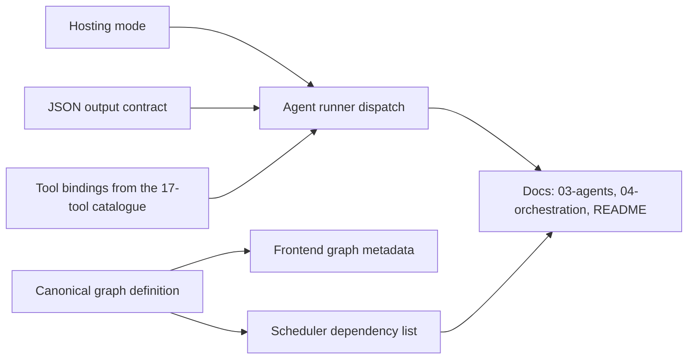
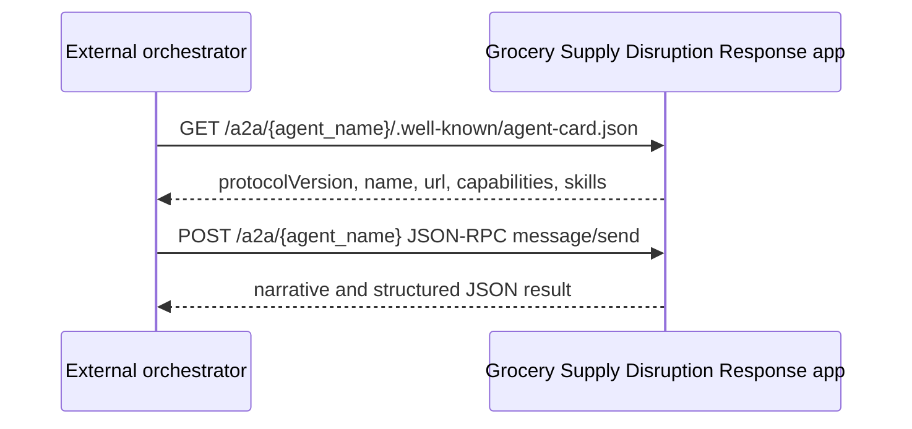

# Extending the solution

## Add an agent

1. Choose a unique `node_id` and PascalCase agent name that follow the existing naming style.
2. Add the node to the canonical graph with explicit upstream dependencies and row/column placement.
3. Select one hosting mode: `foundry`, `local`, `a2a`, or `system`.
4. Define the exact JSON output contract and keep `narrative` as the human-readable summary.
5. Bind only the tools the agent needs from the 17-tool catalogue.
6. Add it to the scheduler dependency list and frontend graph metadata.
7. Update `docs/03-agents.md`, `docs/04-orchestration.md`, and the README agent table.

A new validation agent should normally depend on `response_planner` and feed `scenario_evaluation`. A new execution agent should normally depend on `executive_gate` and feed `executive_briefing`.

## Add a tool

1. Add an async handler with typed parameters.
2. Add the tool schema with the exact function name, JSON parameter schema, and bounded return shape.
3. Ensure it can read Cosmos DB and degrade to bundled data where appropriate.
4. Add it only to agents whose prompts need it.
5. Update tool documentation in the README and `docs/03-agents.md`.

Tool results should be small, deterministic, and directly grounded in datasets or Search passages. If a tool can expose sensitive business data in a real deployment, add filtering and authorization before production use.

## Add a dataset

1. Create a JSON array under `data/` with unique `id` values and stable `partitionKey` values.
2. Add the repository container-to-file mapping.
3. Add seeding support for the Cosmos container and partition key.
4. Update referential-integrity validation so all ids resolve.
5. Document the dataset, full field list, and integrity rules in `docs/05-data-model.md`.

## Add a new disruption scenario

1. Add a new record to `signals.json` that matches `DisruptionSignal.to_dict()` camelCase keys plus `id` and `partitionKey`.
2. Ensure `productId`, `supplierId`, `impactedSkus`, and `affectedWarehouses` all reference existing records.
3. Add or adjust product, supplier, inventory, forecast, promotion, replenishment, past-disruption, playbook, and knowledge records so the scenario is grounded.
4. Keep `source` stable if the signal comes from the Databricks stub or update it to the new detection source.
5. Verify `/api/scenario` and `POST /api/runs/stream` can run the scenario in degraded mode.

## Databricks signal extension point

The current detection source is `databricks-stub`. A Databricks job can replace the stub by producing the same signal contract:

* `productId`, `productName`, `category`, and `supplierId`
* `confidence`
* `depletionDaysMin` and `depletionDaysMax`
* `supplyShortfallPct` and `demandSurgePct`
* `impactedSkus`, `affectedRegions`, and `affectedWarehouses`
* `rootCause`, `source`, and `detectedAt`

The orchestrator does not need to know whether the signal came from the bundled dataset, an HTTP caller, or Databricks as long as the contract is preserved.

## A2A agent cards and external orchestration

Every A2A-capable agent exposes an agent card at `/a2a/{agent_name}/.well-known/agent-card.json` and accepts JSON-RPC 2.0 `message/send` at `/a2a/{agent_name}`. The card advertises `protocolVersion`, `name`, `description`, `version`, `url`, `capabilities`, input/output modes, and skills.

An external orchestrator such as Copilot Studio can consume these cards to discover the agent name, endpoint, description, and JSON output behavior. Production integration should add caller authentication, authorization, rate limiting, and audit logging before exposing A2A endpoints outside the trusted app boundary.

