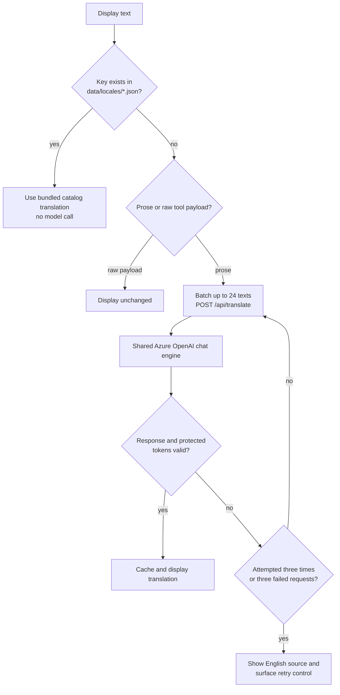

# Console languages and execution output

The header has a flag-based language selector immediately before the theme
button: EN (English), FR (French), GER (German), and ES (Spanish).
German uses the standard language code `de` internally. The document's `lang`
attribute follows the selected language for assistive technology.

## Switching languages

The `gsdr-language` preference cookie remembers the selection for one year.
The default is English. Changing languages updates the current display without
resetting the stream, results, approval choice, or theme. Existing results and
event messages can be viewed in another language without re-running agents.
Dates and formatted currency and number values use `en-GB`, `fr-FR`, `de-DE`,
or `es-ES`.

Translations only affect presentation. Canonical API responses, numeric values,
product and supplier identifiers, node IDs, option IDs, tool names, and approval
payloads are not rewritten. Structured output displays localized field labels and
human-readable values; it is a view of the original data, not a new tool result.
User-entered approver identity and notes are not silently rewritten on submission.

## Catalogs and generated content




`data/locales/fr.json`, `de.json`, and `es.json` contain matching English-source
keys and translations, including interface text and reference incident content.
Keep `{placeholder}` names identical across languages. The frontend bundles these
files, and the backend can reuse them for known text without inference.

For new model-generated narratives, scenario descriptions, rationale, and other
uncatalogued display text, the browser batches requests to:

```http
POST /api/translate
Content-Type: application/json

{"language":"fr","texts":["Additional certified supply is available."]}
```

The response contains `translations` in the same order as `texts`. This endpoint
uses the existing Azure OpenAI model and identity through the shared chat engine,
with no additional Azure resources, credentials, or external translation service.
Translation consumes model tokens in addition to workflow inference.

The browser deduplicates and caches translations, batches visible content, and
ignores stale responses when the language changes. The endpoint validates request
and response shapes and bounds batch sizes. Requests contain at most 24 strings,
12,000 characters per string, and 40,000 characters in total.
The encoded request body is capped at 512,000 bytes. After technical tokens are
protected, the model prompt is limited to 80,000 characters; oversized expanded
requests are rejected before inference. The translation deadline is 45 seconds.

To keep long agent Execution details from translating one batch at a time, the
browser sends up to three requests concurrently and caps each request at 12,000
characters, so a slow batch no longer blocks the rest of the visible content.

While translation is pending, the original content remains readable and the
header shows the translation status. A text whose translation fails validation, or
whose protected technical tokens come back altered, is degraded to its English
source and reported back, so the rest of the batch still displays translated; the
browser then retries that text on its own, isolating the item the provider rejects
instead of leaving the remaining content in English. Provider output is never shown
for a degraded text. Tool payloads that are raw data rather than prose, such as a
truncated JSON result, are displayed unchanged and are never sent for translation.
A text is attempted at most three times, and three consecutive failed requests are
treated as an outage: automatic requests stop, the header explicitly indicates that
original text is being shown, and it offers a retry. Bundled interface/reference
translations continue working in offline mode; arbitrary newly generated prose
requires a configured model.

## Execution details

Narrative and structured Output share an emphasized, high-contrast panel. Dark
theme uses a white output surface and dark text; light theme uses a contrasting
output surface. Output headings, controls, badges, code text, and placeholders
use colors that remain readable on that surface. Input, errors, timing metrics,
and tool activity remain visually distinct.

Because the Output panel keeps a light surface in both themes, it re-declares
the full colour token set locally, so no dark-theme colour can be inherited onto
its white background.

## Colour contrast

Both themes target WCAG 2.1 AA: at least 4.5:1 for body text and at least 3:1
for large text. The light theme uses deep, saturated foreground colours rather
than pale ones, including on tinted status chips where the tint itself lightens
the background. Component styles never hard-code a colour; every surface, line,
text, status, and agent-graph colour comes from a token defined once per theme
in `src/frontend/src/index.css`.

## Verification

```powershell
Set-Location src\frontend
npm run build
npm test
Set-Location ..\..
.\.venv\Scripts\python.exe -m unittest discover -s tests -p test_localization.py
```

Frontend checks cover catalogs and placeholders, cached/batched translation,
language changes during requests, error/retry behavior, unchanged business data,
and request limits. Backend tests mock inference so they need no Azure credentials.
The standard CI runs both sets of checks and includes catalogs in the Docker build.
